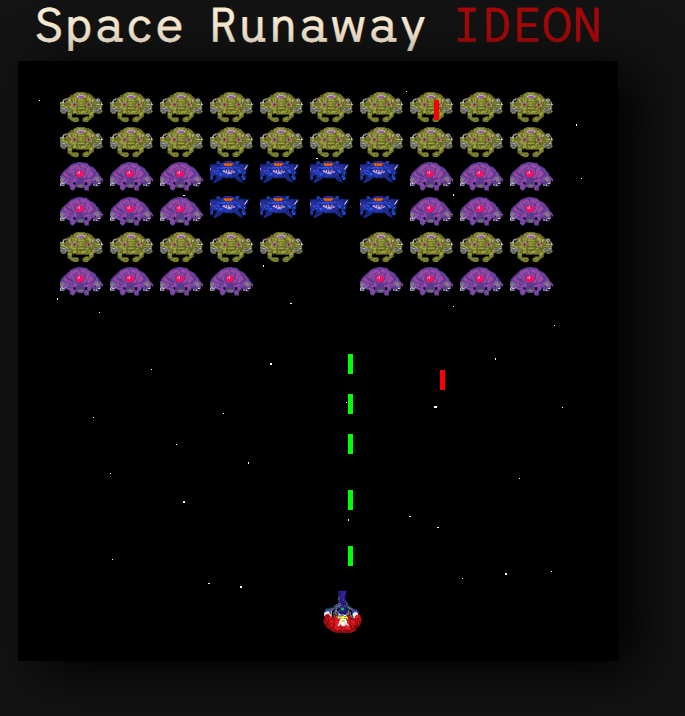

# ***A Space invaders clone***
# 👾👾👾

My main goal with this project was to learn more about classes and Modules in Javascript before heading into the world of React.js 

# About the Game

In this game our main objective is to eliminate all the enemies before they shoot or collide with us, they came at the top of the screen and move side to side and down toward our player 

# 

## How to play
You can download this repository in your machine or 
[🔗 Clicking over here to play](https://lucent-starburst-8ad5df.netlify.app)

## How it Works
* The Javascript is set in an HTML canvas
* In the index.js file is our game loop that is responsible for checking if is Game Over and rendering our game on the screen
* for the enemies movement is used a funcition for update the velocity and another one to move down in a new direction
* The player movement and attack uses functions that check clicks on the keyboard and update in the game
* The enemy attack is randomly generated using Math.random

## 🛠 Technologies

- HTML
- CSS
- JAVASCRIPT
- Git and Github

## Contact

lucasps465@outlook.com

